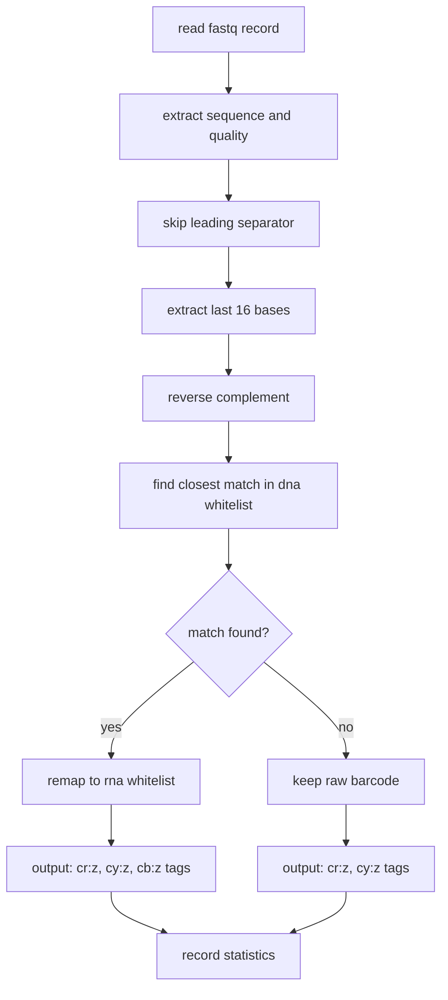

# barcode-corrector

Efficient Python implementation of barcode correction for single-cell genomics FASTQ files.

Translates the functionality of `correct_barcode_from_fastq.sh` from the original single_cell_toolkit into pure Python with improved variable naming and efficiency.

## Barcode Correction Logic

The barcode corrector processes FASTQ files containing raw barcode sequences from single-cell genomics experiments:



## Quick Start

```bash
pip install -e .

correct-barcodes dna_whitelist.txt.gz rna_whitelist.txt.gz input.fastq.gz output.tsv --stats-file stats.tsv
```

## Usage

```bash
correct-barcodes <dna_whitelist_file> <rna_whitelist_file> <input_fastq> <output_file> [options]
```

### Example

```bash
correct-barcodes \
    737K-arc-v1.txt.gz \
    737K-rna-v1.txt.gz \
    raw_barcodes.fastq.gz \
    corrected_barcodes.tsv \
    --barcode-suffix 1 \
    --max-mismatches 1 \
    --stats-file correction_stats.tsv
```

## Parameters

- `dna_whitelist_file`: DNA barcode whitelist (one per line)
- `rna_whitelist_file`: RNA barcode whitelist for remapping. Use "false" or "none" to disable.
- `input_fastq`: Input FASTQ with raw barcodes (gzip or uncompressed)
- `output_file`: Output TSV with corrected barcodes
- `--barcode-suffix`: Suffix to append (default: 1)
- `--max-mismatches`: Max mismatches (default: 1)
- `--min-fraction`: Min correctable fraction (default: 0.5)
- `--stats-file`: Statistics output file

## Output Format

Tab-separated columns:
1. read_name
2. cr:z - raw barcode sequence (reverse complemented)
3. cy:z - raw barcode quality (reversed to match rc)
4. cb:z - corrected barcode with suffix (if correctable)
